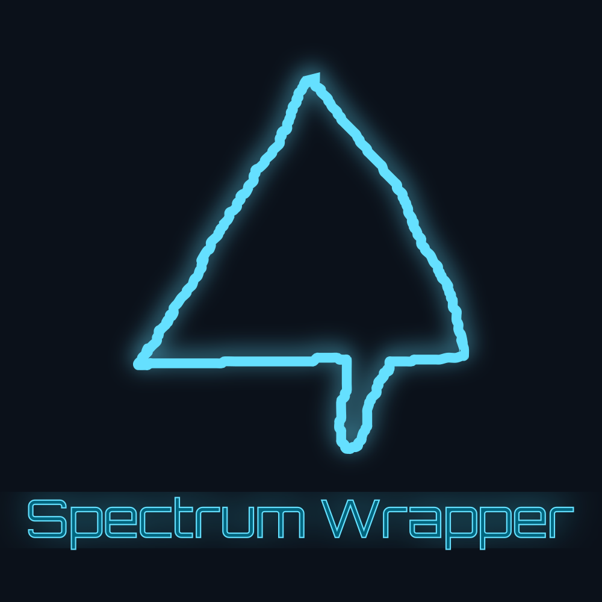

Spectrum Wrapper is a mobile app wrapper for Cloud Imperium Games' Spectrum communications platform.

Currently, Spectrum Wrapper only supports Android.

### Features

* Push Notifications
* Uh, that's about it.

### Download

Get the latest release as an APK [here](https://github.com/hunternet93/SpectrumWrapper/releases/latest).

Coming soon to [Google Play](https://play.google.com).

### Disclaimer

Spectrum Wrapper is third-party software and is not affiliated in any way with Cloud Imperium Games, Spectrum, or Star Citizen.

### How It Works

Spectrum Wrapper uses [Cordova](https://cordova.apache.org/), an open-source framework for porting web apps to mobile platforms. The wrapper simply loads Spectrum in an in-app browser, then runs some Javascript periodically to check for new notifications.

Since Spectrum doesn't expose notifiaction data via an API, the wrapper detects notifications by scraping the DOM instead. This is ugly but works surprisingly well.
